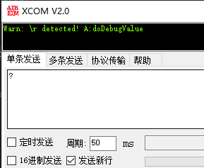
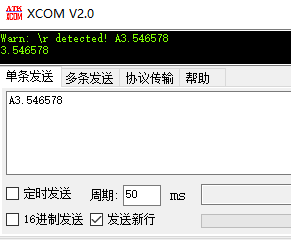

# UsartCMD库使用教程

## 1 日志

 * @外设相关：<font color=Red>usartcmd</font >

   @版本：<font color=Red>1.0</font >

   @维护：<font color=Red>Tony_Wang</font >

   @代码规范：<font color=Red>暂无</font>
   
* p.s：移植 adurino 的 Commander 库，完成在 stm32 上的基本功能
  
  
   | 版本                               |                          功能                           |
   | :--------------------------------- | :-----------------------------------------------------: |
   | <font color=DeepSkyBlue>1.0</font> | <font color=DeepSkyBlue>针对串口接受控制命令解析</font> |
   |                                    |                                                         |

 ## 2 文件介绍

> | app_usartcmd.cpp     | 串口CMD主文件     |
> | -------------------- | ----------------- |
> | **app_usartcmd.hpp** | **串口CMD头文件** |
> >| 头文件名          | 版本要求             | p.s           |
> >| ----------------- | -------------------- |-------------------- |
> >| **dep.hpp**       | **依赖库 V1_0 以上** |               |
> >| **bsp_usart.hpp** | **串口库 V2_0 以上** |**DMA 版本**|
> >| **memery.hpp** | **存储库 V1_1 以上** |**环形 fifo**|


 ## 3 重要函数介绍

### 3.1 串口控制类 UsartCMD

```cpp
class UsartCMD
{
public:
	/**
	 * Default constructor receiving a serial interface that it uses to output the values to
	 * Also if the function run() is used it uses this serial instance to read the serial for user commands
	 *
	 * @param serial - Serial com port instance
	 * @param eol - the end of line sentinel character
	 * @param echo - echo last typed character (for command line feedback)
	 */
	UsartCMD(UART_HandleTypeDef *huart, char eol = '\n', bool echo = false);
	UsartCMD(char eol = '\n', bool echo = false);

	/**
	 * Function reading the serial port and firing callbacks that have been added to the UsartCMD
	 * once the user has requested them - when he sends the command
	 *
	 *  - It has default commands (the letters can be changed in the commands.h file)
	 *    '@' - Verbose mode
	 *    '#' - Number of decimal places
	 *    '?' - Scan command - displays all the labels of attached nodes
	 */
	void run();
	/**
	 * Function reading the string of user input and firing callbacks that have been added to the UsartCMD
	 * once the user has requested them - when he sends the command
	 *
	 *  - It has default commands (the letters can be changed in the commands.h file)
	 *    '@' - Verbose mode
	 *    '#' - Number of decimal places
	 *    '?' - Scan command - displays all the labels of attached nodes
	 *
	 * @param reader - temporary stream to read user input
	 * @param eol - temporary end of line sentinel
	 */
	void run(UART_HandleTypeDef *huart, char eol = '\n');
	/**
	 * Function reading the string of user input and firing callbacks that have been added to the UsartCMD
	 * once the user has requested them - when he sends the command
	 *
	 *  - It has default commands (the letters can be changed in the commands.h file)
	 *    '@' - Verbose mode
	 *    '#' - Number of decimal places
	 *    '?' - Scan command - displays all the labels of attached nodes
	 *
	 * @param user_input - string of user inputs
	 */
	void run(char *user_input);

	/**
	 *  Function adding a callback to the coomander withe the command id
	 * @param id         - char command letter
	 * @param onCommand  - function pointer void function(char*)
	 * @param label      - string label to be displayed when scan command sent
	 */
	void add(char id, CommandCallback onCommand, char *label = nullptr);

	// printing variables
	VerboseMode verbose = VerboseMode::user_friendly; //!< flag signaling that the commands should output user understanable text
	/* decimal_places 用于回发数据的小苏位数控制，这个功能全部集成在了 serialstudio 了 */
	// uint8_t decimal_places = 3;						  //!< number of decimal places to be used when displaying numbers

	// monitoring functions
	UART_HandleTypeDef *com_port = nullptr; //!< Serial terminal variable if provided
	// UART_HandleTypeDef* com_port; //!< Serial terminal variable if provided
	char eol = '\n';   //!< end of line sentinel character
	bool echo = false; //!< echo last typed character (for command line feedback)

	/**
	 * Float variable scalar command interface
	 *  - It only has one property - one float value
	 *  - It can be get by sending an empty string '\n'
	 *  - It can be set by sending 'value' - (ex. 0.01 for settin *value=0.01)
	 */
	void scalar(float *value, char *user_cmd);

private:
	// Subscribed command callback variables
	CommandCallback call_list[20]; //!< array of command callback pointers - 20 is an arbitrary number
	char call_ids[20];			   //!< added callback commands
	char *call_label[20];		   //!< added callback labels
	int call_count = 0;			   //!< number callbacks that are subscribed

	// helping variable for serial communication reading
	char received_chars[MAX_COMMAND_LENGTH] = {0}; //!< so far received user message - waiting for newline
	int rec_cnt = 0;							   //!< number of characters receives

	// // serial printing functions
	// /**
	//  *  print the string message only if verbose mode on
	//  *  @param message - message to be printed
	//  */
	// void printVerbose(const char *message);
	// /**
	//  *  Print the string message only if verbose mode on
	//  *  - Function handling the case for strings defined by F macro
	//  *  @param message - message to be printed
	//  */
	// void printVerbose(const __FlashStringHelper *message);
	// /**
	//  *  print the numbers to the serial with desired decimal point number
	//  *  @param message - number to be printed
	//  *  @param newline - if needs lewline (1) otherwise (0)
	//  */

	// void print(const float number);
	// void print(const int number);
	// void print(const char *message);
	// void print(const __FlashStringHelper *message);
	// void print(const char message);
	// void println(const float number);
	// void println(const int number);
	// void println(const char *message);
	// void println(const __FlashStringHelper *message);
	// void println(const char message);

	// void printError();
	bool isSentinel(char ch);
};
```

* 声明：包含串口号，尾字符，自动回发使能

  ```cpp
  	UsartCMD(UART_HandleTypeDef *huart, char eol = '\n', bool echo = false);
  	UsartCMD(char eol = '\n', bool echo = false);
  
  //example
  UsartCMD command_usart1 = UsartCMD(fusart_Debug);
  ```

### 3.2 add 添加回调函数 

```cpp
/**
 * @brief  add 添加命令函数
 * @details 加入回调函数到 UsartCMD
 * @param [in]   id	命令字符
 * @param [in]	onCommand 回调函数名
 * @param [in]	label 对应的字符串名称
 * @retval 
 */
void UsartCMD::add(char id, CommandCallback onCommand, char *label)
{
	call_list[call_count] = onCommand;
	call_ids[call_count] = id;
	call_label[call_count] = label;
	call_count++;
}

//example
/**
 * @brief  打印接受到的数据
 * @details
 * @param ID：A
 * @param cmd：数据地址
 * @retval
 */
void doDebugValue(char *cmd)
{
	static float debugvalue;
	command_usart1.scalar(&debugvalue, cmd);
	printf("%f\n", debugvalue);
}
command_usart1.add('A', doDebugValue, (char *)"doDebugValue");
```

* 声明 CommandCallback 的一类函数，通过 add 函数连接到回调函数列表

### 3.3 run 运行函数

```cpp
/**
 * @brief  run 运行函数
 * @details 串口有声明通道进行下一步
 * @param [in]
 * @retval
 */
void UsartCMD::run()
{
	if (com_port == nullptr)
		return;
	run(com_port, eol);
}

/**
 * @brief  run 运行函数
 * @details 接串口fifo中转存，进入后续解析
 * @param [in] 串口通道
 * @param [in] 尾帧
 * @retval
 */
void UsartCMD::run(UART_HandleTypeDef *huart, char eol)
{
	UART_HandleTypeDef *tmp = com_port; // save the serial instance
	char eol_tmp = this->eol;
	this->eol = eol;
	com_port = huart;

	// a string to hold incoming data
	while (RxDebug_fifo.check_state() != FIFO_EMPTY)
	{
		// get the new byte:
		uint8_t ch;
		RxDebug_fifo.pop(&ch);
		received_chars[rec_cnt++] = (char)ch;
		// end of user input
		if (echo)
			printf("%c", (char)ch);
		if (isSentinel(ch))
		{
			// execute the user command
			run(received_chars);

			// reset the command buffer
			received_chars[0] = 0;
			rec_cnt = 0;
		}
		if (rec_cnt >= MAX_COMMAND_LENGTH)
		{ // prevent buffer overrun if message is too long
			received_chars[0] = 0;
			rec_cnt = 0;
		}
	}

	com_port = tmp; // reset the instance to the internal value
	this->eol = eol_tmp;
}

/**
 * @brief  run 运行函数
 * @details 接受内容解析
 * @param [in] 转存后的数据地址
 * @retval
 */
void UsartCMD::run(char *user_input)
{
	// execute the user command
	char id = user_input[0];
	switch (id)
	{
	case CMD_SCAN:
		for (int i = 0; i < call_count; i++)
		{
			printf("%c", call_ids[i]);
			printf(":");
			if (call_label[i])
				printf("%s\r\n", call_label[i]);
			else
				printf("\r\n");
		}
		break;
	case CMD_VERBOSE:
		/* 控制回发的变量，对于 stm32 没什么用 */
		// if (!isSentinel(user_input[1]))
		// 	verbose = (VerboseMode)atoi(&user_input[1]);
		// printVerbose(F("Verb:"));
		// switch (verbose)
		// {
		// case VerboseMode::nothing:
		// 	println(F("off!"));
		// 	break;
		// case VerboseMode::on_request:
		// case VerboseMode::user_friendly:
		// 	println(F("on!"));
		// 	break;
		// }
		break;
	case CMD_DECIMAL:
		/* 控制数据采样的小数位数，这部分功能使用 serialstudio 了，对于 stm32 没什么用 */
		// if (!isSentinel(user_input[1]))
		// 	decimal_places = atoi(&user_input[1]);
		// printVerbose(F("Decimal:"));
		// println(decimal_places);
		// break;
	default:
		for (int i = 0; i < call_count; i++)
		{
			if (id == call_ids[i])
			{
				call_list[i](&user_input[1]);
				break;
			}
		}
		break;
	}
}
//example
command_usart1.run();
```

* run 运行函数，包含判断串口通道，数据转存，数据解析
* 使用上直接调用 run 即可

### 3.4 其余函数

```cpp
/**
 * @brief  scalar 浮点型转换
 * @details 解析提取字符串数据为浮点
 * @param [in] value：放置的浮点数据地址
 * @param [in] user_cmd：接受转存后的数据地址
 * @retval
 */
void UsartCMD::scalar(float *value, char *user_cmd)
{
	bool GET = isSentinel(user_cmd[0]);
	if (!GET)
		*value = atof(user_cmd);
	//   println(*value);
	printf("%.*s\n", rec_cnt, received_chars);
}
//example
float debugvalue;
command_usart1.scalar(&debugvalue, cmd);
```

* scalar 浮点型转换

```cpp
/**
 * @brief  isSentinel 尾帧判断
 * @details 对是否检测到尾帧进行判断
 * @param [in] ch：需要检测的字符
 * @retval
 */
bool UsartCMD::isSentinel(char ch)
{
	if (ch == eol)
		return true;
	else if (ch == '\r')
	{
		//   printVerbose(F("Warn: \\r detected! \n"));
		printf("Warn: \\r detected! \n");
	}
	return false;
}
```

* 尾帧检测，在 run 中有调用，并且使用 \r\n 时会回发 \r 的检测情况，嫌烦可以把这句话注释，因为尾帧只能写一个字符

 ## 4 自定义修改参数

1. 基本额定参数

```cpp
#define MAX_COMMAND_LENGTH 20	//一帧数据的最大长度
```


 ## 5 基本使用方法

### 5.1 默认使用方法

* 声明一个 UsartCMD 类变量

```cpp
UsartCMD command_usart1 = UsartCMD(fusart_Debug);xxxxxxxxxx UsartCMD command_usart1 = UsartCMD(fusart_Debug);encoder HallEncoder(360, ReadAngle);
```

* 声明相关回调函数

```cpp
/**
 * @brief  打印接受到的数据
 * @details
 * @param ID：A
 * @param cmd：数据地址
 * @retval
 */
void doDebugValue(char *cmd)
{
	static float debugvalue;
	command_usart1.scalar(&debugvalue, cmd);
	printf("%f\n", debugvalue);
}
```

* 添加回调函数到类

```cpp
command_usart1.add('A', doDebugValue, (char *)"doDebugValue");
```

* run 周期运行
* 串口助手中调试



 ## 6 其他注意


 
