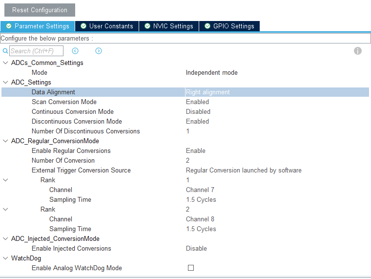
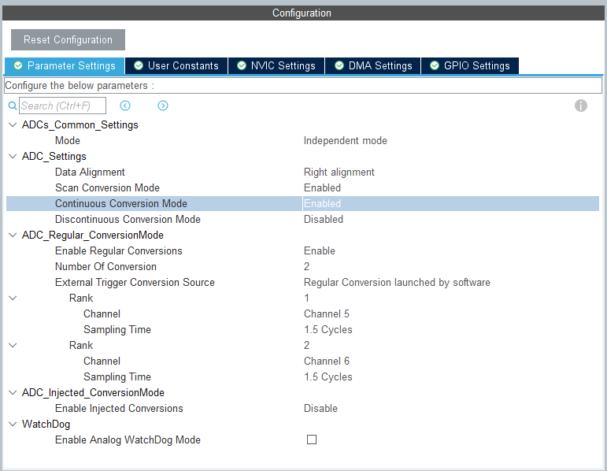
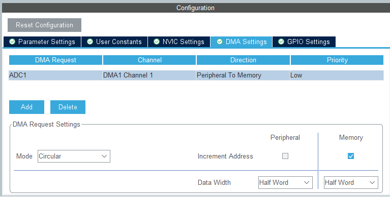

# ADC库使用教程

## 1 日志

 * @外设相关：<font color=Red>adc</font >

   @版本：<font color=Red>1.1</font >

   @维护：<font color=Red>Tony_Wang</font >

   @代码规范：<font color=Red>暂无</font>
   
    
   
  
   | 版本                               |                          功能                           |
   | :--------------------------------- | :-----------------------------------------------------: |
   | <font color=DeepSkyBlue>1.0</font> |   <font color=DeepSkyBlue>基本Cube配置DMA配置</font>    |
   | <font color=DeepSkyBlue>1.1</font> | <font color=DeepSkyBlue>增加测不准修改的配置文件</font> |
   
   
   | 版本                               |                             更新时间                             |功能|
   | :--------------------------------- | :----------------------------------------------------------: | :----------------------------------------------------------: |
   | <font color=DeepSkyBlue>2.0</font> | <font color=DeepSkyBlue>2023-8-31</font> |<font color=DeepSkyBlue>修改为cpp文件，区分普通adc与dmaadc</font>|
   |                                    |                                          |                                                              |
   |                                    |                                          |                                                              |
   |                                    |                                          |                                                              |


 ## 2 文件介绍

> | bsp_adc.cpp     | adc主文件     |
> | --------------- | ------------- |
> | **bsp_adc.hpp** | **adc头文件** |
> 
> 可能需要依托的文件.
> > 
> > | 依赖库名称    | 版本 | 依赖功能 |
> > | ------------- | -------- |-------- |
> > | dep.hpp | V1.0 |  |
> > |            |      |          |
> > |               |          |          |

 ## 3 重要函数介绍

### 3.1 ADC 普通类

```cpp
class bsp_ADC
{
public:
	ADC_HandleTypeDef *hadc; // 使用的adc通道
	uint8_t NUMs_channel;	 // 通道数量

	uint16_t data_list[16]; // 数据存放列表

	// 成员函数
	bsp_ADC(void){};
	bsp_ADC(ADC_HandleTypeDef *hadc, uint8_t NUMs_channel);
	// ~bsp_ADC();
	void init(void);   // 初始化使能adc相关功能
	void update(void); // 数据更新

protected:
private:
};
```

* 使用轮训的方式采样

#### 3.1.1 初始化

```cpp
bsp_ADC bsp_ADC2 = bsp_ADC(&hadc2, 2);

/**
 * @brief    init 初始化使能相关功能
 * @details  主要使能校准
 * @param
 * @return
 */
void bsp_ADC::init(void)
{
	HAL_ADCEx_Calibration_Start(hadc);
}
```

* 声明需要添加 adc 编号和，通道数量
* 初始化中进行 adc 校准

#### 3.1.2 数据更新

```cpp
/**
 * @brief    update 数据更新
 * @details  所有通道进行一次ADC采样转换
 * @param
 * @return
 */
void bsp_ADC::update(void)
{
	for (uint8_t i = 0; i < NUMs_channel; i++)
	{
		HAL_ADC_Start(hadc);
		HAL_ADC_PollForConversion(hadc, 50);
		data_list[i] = HAL_ADC_GetValue(hadc);
	}
	HAL_ADC_Stop(hadc);
}
```

* 数据更新会对所有通道进行一次采样，全部更新
* 之后直接调用 data_list 即可

### 3.2 使用 DMA 的 ADC

```cpp
/* ******************* 派生用于 DMA 采样的 ADC 类 ********************* */
class bsp_ADC_DMA : public bsp_ADC
{
public:
	uint16_t *data_DMA_buffer; // 连接到的用于存储DMA的数组

	// 成员函数
	bsp_ADC_DMA(ADC_HandleTypeDef *hadc, uint8_t NUMs_channel, uint16_t *data_DMA_buffer);
	// ~bsp_ADC_DMA();
	void init(void);   // 初始化使能adc相关功能
	void update(void); // 数据更新

protected:
private:
};
```

* 额外需要链接一个 DMA 数组

#### 3.2.1 初始化

```cpp
uint16_t bsp_adc_dma1_buffer[2];
bsp_ADC_DMA bsp_adc_dma1 = bsp_ADC_DMA(&hadc1, 2, bsp_adc_dma1_buffer);

/**
 * @brief    init 初始化使能相关功能
 * @details  主要使能校准 开启DMA功能
 * @param
 * @return
 */
void bsp_ADC_DMA::init(void)
{
	HAL_ADCEx_Calibration_Start(hadc);
	HAL_ADC_Start_DMA(hadc, (uint32_t *)data_DMA_buffer, NUMs_channel);
}

```

* 先声明一个数组，在声明类时链接
* 初始化完成校准和开启DMA

#### 3.2.2 数据更新

```cpp
/**
 * @brief    update 数据更新
 * @details  所有通道读取一次DMA数据
 * @param
 * @return
 */
void bsp_ADC_DMA::update(void)
{
	for (uint8_t i = 0; i < NUMs_channel; i++)
	{
		data_list[i] = data_DMA_buffer[i];
	}
}
```

* 转存 DMA 数据到内存


 ## 4 自定义修改参数


## 5 基本使用方法

### 5.1 普通 ADC

* Cube配置中在<font color='DeepSkyBlue'>ADC</font>开启
* 使能 <font color='DeepSkyBlue'>Scan Conversion Mode（扫描模式）</font>和和<font color='DeepSkyBlue'>Enable Regular Coversions（间隔数量为1）</font>
* 修改<font color='DeepSkyBlue'>Number Of Conversion</font>数量改为实际使用的ADC通道的数量，并在<font color='DeepSkyBlue'>rank</font>中分别写上采样的通道和时间
* 开启 NVIC 中断 （实际上没用）
* 声明 adc 变量 ， 调用数据更新函数
* 

### 5.2 DMA ADC使用

* Cube配置中在<font color='DeepSkyBlue'>ADC</font>开启，F1只能用 ADC1
* 使能<font color='DeepSkyBlue'>Scan Conversion Mode（扫描模式）</font>和<font color='DeepSkyBlue'>Continuous Conversion Mode（连续模式）</font>
* 修改<font color='DeepSkyBlue'>Number Of Conversion</font>数量改为实际使用的ADC通道的数量，并在<font color='DeepSkyBlue'>rank</font>中分别写上采样的通道和时间
* 
* 在<font color='DeepSkyBlue'>DMA Settings</font>中增加一个DAM，默认设置，Mode设置为<font color='DeepSkyBlue'>Circular</font>，Increment Address设置为Memory，Data Width均设置为<font color='DeepSkyBlue'>Half Word</font>
* 
* 开启 NVIC 中断 （实际上没用）
* 声明 adc 变量 ， 调用数据更新函数

 ## 6 其他注意

* 发现Sampling Time默认1.5Cycle会出现测不准并且通道间相互影响，修改为55.5Cycle时基本不再出现，但仍有部分静态误差，adc初始化时添加  HAL_ADCEx_Calibration_Start(fadc); 基本修正了静态误差

* 如果像 foc 需要通过定时器 采样 adc， 修改 <font color='DeepSkyBlue'>External Trigger Conversion Sourse（触发源）</font>，并关闭<font color='DeepSkyBlue'>Continuous Conversion Mode（连续模式）</font>

  

