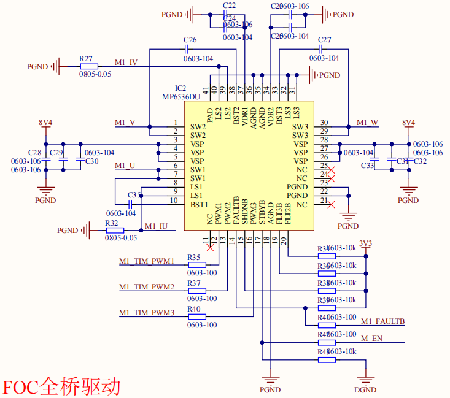

# foc 库使用教程

## 1 日志

 * @外设相关：<font color=Red>foc</font >

   @版本：<font color=Red>1.0</font >

   @维护：<font color=Red>Tony_Wang</font >

   @代码规范：<font color=Red>暂无</font>
   
    
   
  
   | 版本                               |                             更新时间                             |功能|
   | :--------------------------------- | :----------------------------------------------------------: | :----------------------------------------------------------: |
   | <font color=DeepSkyBlue>1.0</font> | <font color=DeepSkyBlue>2023-7-8</font> |<font color=DeepSkyBlue>基本构建，完成： 1.开环速度控制 2.基于编码器的位置闭环控制</font>|


 ## 2 文件介绍

> | bsp_foc.cpp     | 主文件     |
> | --------------- | ---------- |
> | **bsp_foc.hpp** | **头文件** |
>
> 可能需要依托的文件
> > | bsp_pid.hpp         | 闭环pid控制    |
> > | ------------------- | -------------- |
> > | **app_encoder.hpp** | **编码器采样** |

 ## 3 重要函数介绍

### 3.1 pwmio 类介绍

```cpp
/* pwm 使能的枚举类型 */
typedef enum
{
	PWM_DISABLE = 0,
	PWM_ENABLE = 1
} PWM_STATE;

/* pwmio 类 定义 */
class pwmio
{
public:
	TIM_HandleTypeDef *htim; // 使用的时钟
	uint32_t TIM_CHANNEL;	 // 使用的时钟通道计数值

	// 成员函数
	pwmio(void){};
	pwmio(TIM_HandleTypeDef *htim, uint32_t TIM_CHANNEL);
	void set_ccr(uint16_t ccr);		 // 设置 pwmio 的 比较值
	void set_state(PWM_STATE state); // pwm 输出控制函数

protected:
	uint16_t ccr;	 // 通道的比较值
	PWM_STATE state; // pwm输出状态
};
```

* 构建的 pwm io 输出类，用于快速声明一个 pwm 输出的 io 口，对 pwm 相关内容进行快速控制


### 3.2 foc 类介绍

```cpp
/*****			foc 构造函数				******/
class foc
{
public:
	pwmio *pwm_u, *pwm_v, *pwm_w; // 三个pwm控制电机三相

	DIR_STATE dir;			// 正转的旋转方向
	uint8_t pole_pairs;		// 极对数
	float shaft_angle;		// 机械角度
	float electrical_angle; // 电角度

	pid *_PID_OUT; // 外环位置环
	void set_PID_OUT(pid *_PID_OUT);

	encoder *_encoder;					 // 使用的编码器
	void set_encoder(encoder *_encoder); // 编码器设置函数

	// 成员函数
	foc(void){};
	foc(pwmio *pwm_u, pwmio *pwm_v, pwmio *pwm_w, int pole_pairs, DIR_STATE dir = FORWARD);
	void init(void);														 // foc 初始化函数
	void set_voltage_limit(float voltage_limit, float voltage_power_supply); // 电压限制设置函数
	void run_speed_Openloop(float target_velocity);							 // 开环运行函数
	void run_angle(float target_angle);										 // 角度闭环运行函数

	float voltage_limit;		// 输出限制电压
	float voltage_power_supply; // 电源电压

	/* 原始电角度偏差值 */
	float zero_electrical_angle = 0.0f;							// 原始电角度偏差值
	float init_ZeroElectricalAngle(uint16_t delaytime);			// 自动检测初始化电角度偏差值函数
	float set_ZeroElectricalAngle(float zero_electrical_angle); // 原始电角度设定

	/* 输入控制参数 */
	float Uq, Ud;

	/* 帕克逆变换后的中间量 */
	float Ualpha;
	float Ubeta;
	/* 克拉克逆变换后的中间量 */
	float Uu, Uv, Uw;

	// 保护成员函数
	float shaftAngle_2_electricalAngle(void);			  // 电角度转换函数
	float _normalizeAngle(float angle);					  // 角度标准化为[0,2PI]
	void run_QDangle(float Uq, float Ud, float angle_el); // 输入Uq，Ud，和电角度，通过克拉克与帕克逆变换
	void run_UVW(float Uu, float Uv, float Uw);			  // 根据最后电压运行函数

protected:
	uint16_t _tim_autoreload; // 当前时钟的重装载值
};
```

* foc 电机类声明 ，目前测试使用 3通道半桥驱动IC mp6536du
* 声明时必须输入 三个 pwmio 类地址 ，电机的极对数

#### 3.2.1 设置电压限幅

```cpp
/**
 * @brief  foc 输出限制配置函数
 * @details
 * @param  	voltage_limit :限制的输出电压
 * @param  	voltage_power_supply :提供的电源电压
 * @retval
 */
void foc::set_voltage_limit(float voltage_limit, float voltage_power_supply)
{
	this->voltage_limit = _constrain(voltage_limit, 0.0f, voltage_power_supply);
	this->voltage_power_supply = voltage_power_supply;
}
```

* voltage_power_supply 为整个供电电压
* voltage_limit 为为电机输入的最大电压，当要求输出的电压超过这个值时，会被限制在这个值

#### 3.2.2 初始化函数

```cpp
/**
 * @brief  foc 初始化函数
 * @details	包括开启使用的三个pwm定时器，读取定时器的 重装载值
 * @param  	
 * @retval
 */
void foc::init(void)
{
	this->pwm_u->set_state(PWM_ENABLE);
	this->pwm_v->set_state(PWM_ENABLE);
	this->pwm_w->set_state(PWM_ENABLE);

	this->pwm_u->set_ccr(0);
	this->pwm_v->set_ccr(0);
	this->pwm_w->set_ccr(0);
	_tim_autoreload = __HAL_TIM_GetAutoreload(this->pwm_u->htim);
}
```

* 开启三个通道的 pwm 输出
* 获取定时器的重装载值，用于后续pwm输出计算


#### 3.2.3 开环速度控制函数

```cpp
/**
 * @brief  开环虚拟速度运行函数
 * @details
 * @param  target_velocity :目标速度
 * @retval
 */
void foc::run_speed_Openloop(float target_velocity)
{
	uint32_t now_us = MICROS_us(); // 获得从芯片启动开始的微秒时间
	/* 计算每个 loop 的运行时间 */
	static uint32_t openloop_timestamp; // 用于计算时间间隔
	float Ts = (now_us - openloop_timestamp) * 1e-6f;

	/* now_us 会在大约 70min 后跳变到 0 ，因此需要进行修正 */
	/* Ts 过大直接修正为一个较小的值 */
	// Ts = Ts > 0.5f ? 1e-3f : Ts;
	if (Ts <= 0 || Ts > 0.5f)
		Ts = 1e-3f;
	/* 通过时间的目标速度虚拟的角度，需要对机械角度归一化为 [0,2PI] */
	shaft_angle = _normalizeAngle(shaft_angle + target_velocity * Ts);
	/* 计算电角度 */
	shaftAngle_2_electricalAngle();

	/* 直接设置 Uq 为电压上限，进行输出 */
	Uq = voltage_limit / 3;
	run_QDangle(Uq, 0, electrical_angle);
	openloop_timestamp = now_us;
}
```

* 输入参数单位为 弧度/s
* 本质原理是通过每次运行的时间差推测电机的电角度进行控制


#### 3.2.4 位置闭环控制

* 闭环控制必须要配置 编码器 和 PID，并检测出原始电角度

##### 3.2.3.1 编码器配置

```cpp
/**
 * @brief  foc 编码器设置函数
 * @details
 * @param  	_encoder :链接配置的编码器，这是一个软核，输出要求为弧度值[0,2PI]
 * @retval
 */
void foc::set_encoder(encoder *_encoder)
{
	this->_encoder = _encoder;
}
```

* 须使用 app_encoder 库，首先要声明编码器
* 传入一个 encoder 变量的地址

##### 3.2.3.2 PID 配置

```cpp
/**
 * @brief  foc 外环设置函数
 * @details
 * @param  	_PID_OUT :链接配置的 pid 类，用于控制位置闭环的，属于外环
 * @retval
 */
void foc::set_PID_OUT(pid *_PID_OUT)
{
	this->_PID_OUT = _PID_OUT;
}
```

* 须使用 bsp_pid 库，首先要声明一个 pid 变量
* 传入一个 pid 变量的地址

##### 3.2.3.3. 原始电角度测试

```cpp
/**
 * @brief  自动检测初始化电角度偏差值函数
 * @details
 * @param  delaytime :等待电机给一个等特定电压的时间，用于稳定电机
 * @retval
 */
float foc::init_ZeroElectricalAngle(uint16_t delaytime)
{
	/* 上电到特定角度 */
	run_QDangle(voltage_limit / 2, 0, 3 * BSP_FOC_PI / 2);
	/* 等待电机转到该位置 */
	HAL_Delay(delaytime);
	/* 编码器读取该位置的机械角度 */
	shaft_angle = _encoder->get_count();
	/* 转换为该位置绝对电角度 */
	set_ZeroElectricalAngle(0);
	shaftAngle_2_electricalAngle();
	/* 该位置的电角度设置为 初始零电角度 */
	set_ZeroElectricalAngle(electrical_angle);
	run_QDangle(0, 0, 3 * BSP_FOC_PI / 2);

	return zero_electrical_angle;
}
```

* 初始化的时候调用该函数，会旋转到一个指定位置，然后读取该位置的电角度作为原始电角度用于闭环计算
* 输入参数为等待电机转到设定位置的时间，最多给个3s足以
* 这个参数只与霍尔安装有关，测出来之后只需要调用函数设定这个时候读取到的原始电角度即可

```cpp
motor_1612.set_ZeroElectricalAngle(1.15f);
```

##### 3.2.3.4 位置闭环运行函数

```cpp
/**
 * @brief  闭环位置运行函数
 * @details
 * @param  target_angle :目标角度，由于过程中计算均使用弧度值，这里输入角度制，方便理解
 * @retval
 */
void foc::run_angle(float target_angle)
{
	/* 转换输入的角度值变为弧度值 */
	target_angle = (target_angle / 180.0f) * BSP_FOC_PI;
	/* 获取机械角度 */
	shaft_angle = _encoder->get_count();
	/* 转化为电角度 */
	shaftAngle_2_electricalAngle();
	/* 运行pid */
	run_QDangle(_PID_OUT->pid_run(target_angle - shaft_angle), 0, electrical_angle);
}
```

* 输入单位为 度°


 ## 4 自定义修改参数

* 位置闭环中目前调用的是编码器直接读取的角度值，一圈之后会清零，希望无数圈任意闭环修改调用的编码器函数

```cpp
/* 编码器读取该位置的机械角度 */
	//shaft_angle = _encoder->get_count();
	//改为
	shaft_angle = _encoder->get_date();
	
```


 ## 5 基本使用方法

### 5.1 默认使用方法

* Cube配置中在<font color='DeepSkyBlue'>pwm输出3个通道</font>，脉冲频率设置为<font color='DeepSkyBlue'>30kHz以上</font>，pwm输出模式的 Fast Mode 设置为 Enable ，GPIO 输出速率设置为最大， 开启对应时钟中断
* 声明使用的三个 pwmio ，foc
* 主函数中调用 <font color='DeepSkyBlue'>set_voltage_limit()</font> 设置电压限制，适应 <font color='DeepSkyBlue'>init()</font> 初始化foc电机
* 开环 循环使用 <font color='DeepSkyBlue'>run_speed_Openloop(速度)</font> 进行开环控制
* 闭环控制首先在程序运行之初通过 <font color='DeepSkyBlue'>set_encoder(&HallEncoder);</font> 和 <font color='DeepSkyBlue'>set_PID_OUT(&pid_1612);</font> 配置编码器和pid
* 闭环 循环调用 <font color='DeepSkyBlue'>run_angle(180);</font> 控制闭环角度


 ## 6 其他注意

* mp6536du 这种半桥驱动芯片，<font color='red'>一定要焊接完全</font>，两个采样电阻不焊就会出问题，不然运行是不正常的

 

* 如果不知道电机的极对数，直接使用函数设定输出一个特定电压，然后用手掰一转，有几个停止点就是几相

```cpp
motor_1612.pwm_u->set_ccr(300);
motor_1612.pwm_v->set_ccr(0);
motor_1612.pwm_w->set_ccr(0);
```


* 这个库封装的快，部分中间计算存储变量都没用放在 protect 中，后续优化需要注意

  
