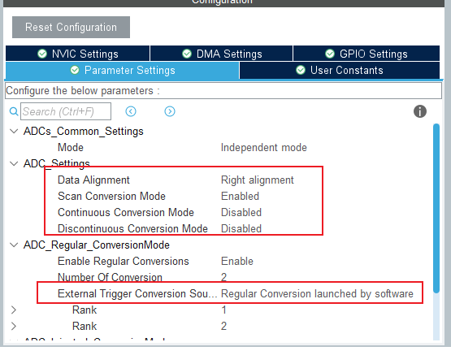
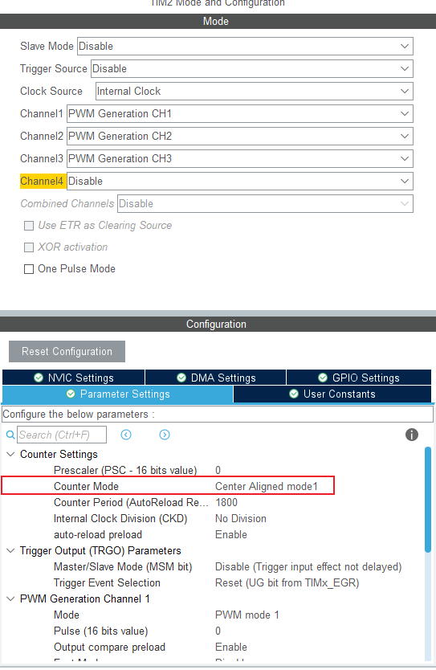
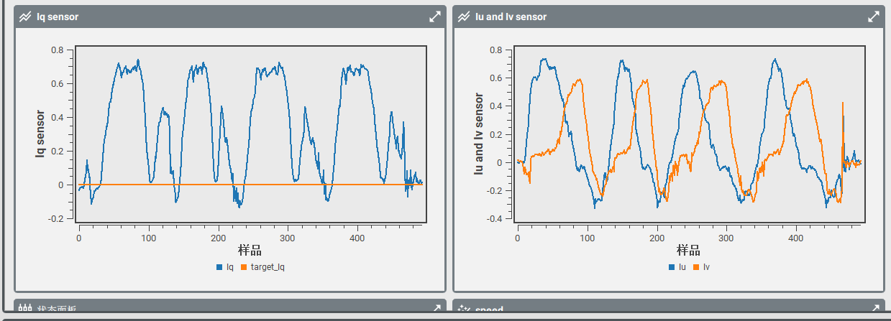

# foc 库使用教程

## 1 日志

 * @外设相关：<font color=Red>foc</font >

   @版本：<font color=Red>2.0 Beta</font >

   @维护：<font color=Red>Tony_Wang</font >

   @代码规范：<font color=Red>暂无</font>
   
    
   
  
   | 版本                               |                             更新时间                             |功能|
   | :--------------------------------- | :----------------------------------------------------------: | :----------------------------------------------------------: |
   | <font color=DeepSkyBlue>1.0</font> | <font color=DeepSkyBlue>2023-7-8</font> |<font color=DeepSkyBlue>基本构建，完成： 1.开环速度控制 2.基于编码器的位置闭环控制</font>|
   | <font color=DeepSkyBlue>1.1</font> | <font color=DeepSkyBlue>2023-8-31</font> |<font color=DeepSkyBlue>重写运行逻辑，改为模式运行</font>|
   | <font color=DeepSkyBlue>2.0 Beta</font> | <font color=DeepSkyBlue>2023-9-18</font> | <font color=DeepSkyBlue>新增电流采样和电流闭环，但是没有调通</font> |
   | <font color=DeepSkyBlue>2.0</font> | <font color=DeepSkyBlue>2023-10-20</font> | <font color=DeepSkyBlue>调通电流采样与电流闭环</font> |
   |                                    |                                          |                                                              |


 ## 2 文件介绍

> | bsp_foc.cpp     | 主文件     |
> | --------------- | ---------- |
> | **bsp_foc.hpp** | **头文件** |
>
> 可能需要依托的文件.
> > 
> > | 依赖库名称    | 版本 | 依赖功能 |
> > | ------------- | -------- |-------- |
> > | dep.hpp         | V1.1 | 基本依赖库           |
> > | bsp_pid.hpp     | V1.0 | DMA 发送             |
> > | app_encoder.hpp | V1.1 | 数据读取 |
> > | bsp_filter.hpp | V1.0 | 基本滤波器库 |
> > | bsp_adc.hpp | V2.0 | cpp版本，使用dma功能 |
> > |               |          |          |
> > |               |          |          |
> > |               |          |          |

 ## 3 重要函数介绍

### 3.1 pwmio 类介绍

```cpp
/* pwm 使能的枚举类型 */
typedef enum
{
	PWM_DISABLE = 0,
	PWM_ENABLE = 1
} PWM_STATE;

/* pwmio 类 定义 */
class pwmio
{
public:
	TIM_HandleTypeDef *htim; // 使用的时钟
	uint32_t TIM_CHANNEL;	 // 使用的时钟通道计数值

	// 成员函数
	pwmio(void){};
	pwmio(TIM_HandleTypeDef *htim, uint32_t TIM_CHANNEL);
	void set_ccr(uint16_t ccr);		 // 设置 pwmio 的 比较值
	void set_state(PWM_STATE state); // pwm 输出控制函数

protected:
	uint16_t ccr;	 // 通道的比较值
	PWM_STATE state; // pwm输出状态
};
```

* 构建的 pwm io 输出类，用于快速声明一个 pwm 输出的 io 口，对 pwm 相关内容进行快速控制


### 3.2 foc 类介绍

```cpp
class foc
{
public:
	pwmio *pwm_u, *pwm_v, *pwm_w; // 三个pwm控制电机三相

	/* EN 使能IO */
	GPIO_TypeDef *EN_GPIO_Port; // 电机使能端口
	uint16_t EN_GPIO_Pin;		// 电机使能引脚

	/* 电机硬相关配置参数 */
	DIR_STATE dir;			// 正转的旋转方向
	uint8_t pole_pairs;		// 极对数
	float shaft_angle;		// 机械角度，单位 rad
	float electrical_angle; // 电角度

	/* 软配置参数 */
	/* 原始电角度偏差值 */
	float zero_electrical_angle = 0.0f; // 原始电角度偏差值
	/* 电压限制 */
	float voltage_limit;		// 输出限制电压
	float voltage_power_supply; // 电源电压
	/* PID */
	pid *_PID_OUT;	   // 外环位置环
	pid *_PID_IN;	   // 内环速度环
	pid *_PID_CURRENT; // 电流环
	/* 编码器 */
	encoder *_encoder = nullptr;	 // 使用的编码器
	DIR_STATE encoder_dir = FORWARD; // 霍尔传感器方向
	/* 电流软传感器 */
	current_sensor *_current_sensor = nullptr; // 使用的电流采样
	/* 滤波器配置 */
	LowPassFilter *_SPEED_LowPassFilter = new LowPassFilter(0.01f); // 速度低通滤波，默认配置一个低通滤波器，时间常数为 10ms
	LowPassFilter *_Iq_LowPassFilter = new LowPassFilter(0.01f);	// q电流低通滤波，默认配置一个低通滤波器，时间常数为 10ms
	LowPassFilter *_Id_LowPassFilter = new LowPassFilter(0.01f);	// d电流低通滤波，默认配置一个低通滤波器，时间常数为 10ms

	/* 运行中间参数 */
	/* 目标运行值 */
	float target_speed;	  // 目标速度
	float target_angle;	  // 目标角度
	float target_current; // 目标电流
	/* 运行状态 */
	foc_run_mode run_mode = speedMode; // 当前运行状态
	/* 运行参数 */
	float speed; // 当前旋转速度,单位 rpm

	/* 以下变量是控制参数，区分 I_ */
	/* 输入控制参数 */
	float U_q, U_d;
	/* 帕克逆变换后的中间量 */
	float U_alpha;
	float U_beta;
	/* 克拉克逆变换后的中间量 */
	float Uu, Uv, Uw;

	/* 以下变量是采样参数，区分 U_ */
	/* 采样实际参数 */
	float I_q, I_d;
	/* 帕克变换后的中间量 */
	float I_alpha;
	float I_beta;

	// 成员函数
	foc(void){};
	foc(pwmio *pwm_u, pwmio *pwm_v, pwmio *pwm_w, int pole_pairs, DIR_STATE dir = FORWARD, GPIO_TypeDef *EN_GPIO_Port = nullptr, uint16_t EN_GPIO_Pin = 0);

	/* foc 使能与失能 */
	void enable(void);
	void disable(void);

	/* 初始化功能函数 */
	float init_ZeroElectricalAngle(uint16_t delaytime); // 自动检测初始化电角度偏差值函数
	void init(void);									// foc 初始化函数

	/* 配置设置函数 */
	void set_voltage_limit(float voltage_limit, float voltage_power_supply); // 电压限制设置函数
	float set_ZeroElectricalAngle(float zero_electrical_angle);				 // 原始电角度设定
	void set_SPEED_LowPassFilter(LowPassFilter *_SPEED_LowPassFilter);		 // 配置 速度低通 滤波器
	void set_Iq_LowPassFilter(LowPassFilter *_Iq_LowPassFilter);			 // 配置 q电流低通 滤波器
	void set_Id_LowPassFilter(LowPassFilter *_Id_LowPassFilter);			 // 配置 d电流低通 滤波器

	void set_PID_OUT(pid *_PID_OUT);						  // 连接 PID 位置环
	void set_PID_IN(pid *_PID_IN);							  // 连接 PID 速度环
	void set_PID_CURRENT(pid *_PID_CURRENT);				  // 连接 PID 电流环
	void set_encoder(encoder *_encoder);					  // 连接 编码器
	void set_current_sensor(current_sensor *_current_sensor); // 连接 电流软传感器

	/* 运行目标设置函数 */
	void set_speed(float _target_speed);					// 设置目标速度
	void set_speed(float _target_speed, foc_run_mode mode); // 带模式的目标速度
	void set_angle(float _target_speed);					// 设置目标角度
	void set_current(float _target_current);				// 设置目标电流

	// 保护成员函数
	/* 数据转换函数 */
	float shaftAngle_2_electricalAngle(void);					 // 电角度转换函数
	float shaftAngle_2_electricalAngle(float shaft_angle_putin); // 电角度转换函数
	float _normalizeAngle(float angle);							 // 角度标准化为[0,2PI]

	/* 运行计算函数 */
	void Clark_Park_Inverse(float I_q, float I_d, float angle_el);			// 输入I_q，I_d，和电角度，通过克拉克与帕克逆变换
	void Clark_Park(float Uu_in, float Uv_in, float Uw_in, float angle_el); // 电流计算 克拉克和帕克变换
	void run_UVW(float Uu, float Uv, float Uw);								// 根据最后电压运行函数

	/* 周期运行功能函数 */
	void run(void); // foc自动运行函数

protected:
	uint16_t _tim_autoreload; // 当前时钟的重装载值
};
```

* foc 电机类声明 ，目前测试使用 3通道半桥驱动IC mp6536du
* 声明时必须输入 三个 pwmio 类地址 ，电机的极对数

#### 3.2.1 设置电压限幅

```cpp
/**
 * @brief  foc 输出限制配置函数
 * @details
 * @param  	voltage_limit :限制的输出电压
 * @param  	voltage_power_supply :提供的电源电压
 * @retval
 */
void foc::set_voltage_limit(float voltage_limit, float voltage_power_supply)
{
	this->voltage_limit = _constrain(voltage_limit, 0.0f, voltage_power_supply);
	this->voltage_power_supply = voltage_power_supply;
}
```

* voltage_power_supply 为整个供电电压
* voltage_limit 为为电机输入的最大电压，当要求输出的电压超过这个值时，会被限制在这个值

#### 3.2.2 初始化函数

```cpp
/**
 * @brief  foc 初始化函数
 * @details	包括开启使用的三个pwm定时器，读取定时器的 重装载值
 * @param  	
 * @retval
 */
void foc::init(void)
{
	this->pwm_u->set_state(PWM_ENABLE);
	this->pwm_v->set_state(PWM_ENABLE);
	this->pwm_w->set_state(PWM_ENABLE);

	this->pwm_u->set_ccr(0);
	this->pwm_v->set_ccr(0);
	this->pwm_w->set_ccr(0);
	_tim_autoreload = __HAL_TIM_GetAutoreload(this->pwm_u->htim);
}
```

* 开启三个通道的 pwm 输出
* 获取定时器的重装载值，用于后续pwm输出计算


#### 3.2.3 运行函数

```cpp
/**
 * @brief  运行函数
 * @details 放在周期循环中自动更新运行状态
 * @param
 * @retval
 */
void foc::run(void)
{
	/* 速度采集放在最开始 */
	this->speed = this->encoder_dir * this->_encoder->get_speed();
	this->speed = Rad2Rot(this->speed);
	this->speed = _SPEED_LowPassFilter->run(this->speed);
	this->shaft_angle = this->encoder_dir * this->_encoder->date;
	shaftAngle_2_electricalAngle(this->encoder_dir * this->shaft_angle);
	/* 电流转换 */
	this->_current_sensor->update(); // 放到定时器中运行了
	this->Clark_Park(this->_current_sensor->phase_u.data,
					 this->_current_sensor->phase_v.data,
					 this->_current_sensor->phase_w.data,
					 this->electrical_angle);
	/* 电流低通滤波 */
	this->I_q = this->_Iq_LowPassFilter->run(this->I_q);
	this->I_d = this->_Id_LowPassFilter->run(this->I_d);
	/* 开环运行模式 */
	if (this->run_mode == openloop)
	{
		uint64_t now_us = MICROS_us(); // 获得从芯片启动开始的微秒时间
		/* 计算每个 loop 的运行时间 */
		static uint32_t openloop_timestamp; // 用于计算时间间隔
		float Ts = (now_us - openloop_timestamp) * 1e-6f;

		/* now_us 会在大约 70min 后跳变到 0 ，因此需要进行修正 */
		/* Ts 过大直接修正为一个较小的值 */
		// Ts = Ts > 0.5f ? 1e-3f : Ts;
		if (Ts <= 0 || Ts > 0.5f)
			Ts = 1e-3f;
		/* 通过时间的目标速度虚拟的角度，需要对机械角度归一化为 [0,2PI] */
		static float openloop_shaft_angle;
		openloop_shaft_angle = _normalizeAngle(openloop_shaft_angle + Rot2Rad(target_speed) * Ts);
		/* 计算电角度 */
		shaftAngle_2_electricalAngle(openloop_shaft_angle);

		/* 电流闭环运行 */
		// this->target_current = voltage_limit / 3;
		// this->U_q = _PID_CURRENT->pid_run(this->target_current - this->I_q);
		// this->U_d = _PID_CURRENT->pid_run(0 - this->I_d);
		/* 直接设置 I_q 为电压上限，进行输出 */
		this->U_q = voltage_limit / 3;
		this->U_d = 0;
		/* 放在最后了 */
		// Clark_Park_Inverse(I_q, 0, electrical_angle);
		openloop_timestamp = now_us;
	}
	/* 速度闭环运行模式 */
	else if (this->run_mode == speedMode)
	{
		/* 放在最上面了 */
		/* 速度环部分 */
		// /* 转换输入的速度值 角度值 变为弧度值 */
		// target_speed = (target_speed / 180.0f) * PI;
		/* 获取速度角度 */
		// speed = _encoder->get_speed();
		// speed = Rad2Rot(speed);
		/* 速度通过低通滤波器 */
		// speed = _SPEED_LowPassFilter->run(speed);
		/* 获得角度值 */
		// shaft_angle = _encoder->date;
		/* 转化为电角度 */
		// shaftAngle_2_electricalAngle();

		/* 控制死区 */
		float err_temp = this->target_speed - this->speed;
		if (err_temp > -0.3 && err_temp < 0.3)
			err_temp = 0;
		/* 运行pid */
		this->target_current = _PID_IN->pid_run(err_temp);
		/* 电流环部分 */
		this->U_q = _PID_CURRENT->pid_run(this->target_current - this->I_q);
		this->U_d = _PID_CURRENT->pid_run(0 - this->I_d);
	}
	/* 位置闭环运行模式 */
	else if (this->run_mode == angleMode)
	{
		/* 位置环部分 */
		/* 获取速度角度 */
		// speed = _encoder->get_speed();
		// speed = Rad2Rot(speed);
		/* 速度通过低通滤波器 */
		// speed = _SPEED_LowPassFilter->run(speed);
		/* 转换输入的角度值变为弧度值 */
		// target_angle = (target_angle / 180.0f) * PI;
		/* 获取机械角度 */
		// shaft_angle = _encoder->date;
		/* 转化为电角度 */
		// shaftAngle_2_electricalAngle();
		/* 运行pid,这里是串级pid，先位置外环再速度内环 */
		this->target_speed = _PID_OUT->pid_run(this->target_angle - Rad2Angle(shaft_angle));
		/* 速度环部分 */
		this->target_current = _PID_IN->pid_run(this->target_speed - speed);
		/* 电流环部分 */
		this->U_q = _PID_CURRENT->pid_run(this->target_current - this->I_q);
		this->U_d = _PID_CURRENT->pid_run(0 - this->I_d);
	}
	/* 电流闭环运行 */
	else if (this->run_mode == currentMode)
	{
		/* 获取机械角度 */
		// shaft_angle = this->_encoder->get_date();
		/* 转化为电角度 */
		// shaftAngle_2_electricalAngle();
		/* 电流采样 */
		// this->_current_sensor->update();
		/* 运行 克拉克和帕克 变换 */
		// this->Clark_Park(this->_current_sensor->phase_u.data,
		// 				 this->_current_sensor->phase_v.data,
		// 				 this->_current_sensor->phase_w.data,
		// 				 this->electrical_angle);
		/* 运行pid,这里是串级pid，运行电流环 */
		this->U_q = _PID_CURRENT->pid_run(this->target_current - this->I_q);
		this->U_d = _PID_CURRENT->pid_run(0 - this->I_d);
	}

	Clark_Park_Inverse(U_q, U_d, electrical_angle);
}
```

* 根据模式运行对应的运行函数，整个范数放在周期循环中即可


#### 3.2.4 配置函数

* 闭环控制必须要配置 编码器 和 PID，并检测出原始电角度

##### 3.2.3.1 编码器配置

```cpp
/**
 * @brief  foc 编码器设置函数
 * @details
 * @param  	_encoder :链接配置的编码器，这是一个软核，输出要求为弧度值[0,2PI]
 * @retval
 */
void foc::set_encoder(encoder *_encoder)
{
	this->_encoder = _encoder;
}
```

* 须使用 app_encoder 库，首先要声明编码器
* 传入一个 encoder 变量的地址

##### 3.2.3.2 PID 配置

```cpp
/**
 * @brief  foc 外环设置函数
 * @details
 * @param  	_PID_OUT :链接配置的 pid 类，用于控制位置闭环的，属于外环
 * @retval
 */
void foc::set_PID_OUT(pid *_PID_OUT)
{
	this->_PID_OUT = _PID_OUT;
}
```

* 须使用 bsp_pid 库，首先要声明一个 pid 变量
* 传入一个 pid 变量的地址
* 三环pid均需要单独配置

##### 3.2.3.3 电流传感配置

* adc_dma 端配置

* 需要链接一个对应的数组大小作为dma的buffer

* 同时先完成 adc_dma 的初始化

  >注意，cube 中的配置需要更改对应的触发方式(一定软件触发)，关闭连续采样
  >
  >

```cpp
uint16_t bsp_adc_dma1_buffer[2];
bsp_ADC_DMA bsp_adc_dma1 = bsp_ADC_DMA(&hadc1, 2, bsp_adc_dma1_buffer);

  /* 电流采样 ADC_DMA 初始化 */
  HAL_Delay(1000);
  bsp_adc_dma1.init();
```

* 链接到 foc 的电流传感类
* 完成初始校准
* 之后会随着电机运行自动采样

```cpp
/* ****************** 电流采样传感器构造函数 ************************** */
class current_sensor
{
public:
	/* 相电流结构体声明 */
	struct phase
	{
		float data;		 // 节点上存储的元素
		int8_t channel;	 // 链接 bsp_ADC_DMA 的数据序号
		float offset;	 // 补偿值
		float ratio = 1; // 电流转换系数
		phase(void){};
		phase(float x) : data(x) {} // 节点的构造函数
		phase(float x, int8_t channel) : data(x), channel(channel) {}
	};

	bsp_ADC_DMA *adc_dma; // 连接的adc采样类

	phase phase_u, phase_v, phase_w; // 三个相

	// 成员函数
	current_sensor(void){};
	current_sensor(bsp_ADC_DMA *adc_dma);
	void set_phase(phase *_phase, int8_t channel, float ratio);
	void calibration(uint16_t times);											  // 偏差校准函数
	void init(int8_t channel_u, int8_t channel_v, int8_t channel_w, float ratio); // 初始化函数
	void init(int8_t channel_u, int8_t channel_v, int8_t channel_w, float ratio_u, float ratio_v, float ratio_w);
	// ~current();
	void update(void); // 数据更新

private:
};

motor_1612.set_current_sensor(&foc_current_sensor);
motor_1612._current_sensor->init(0, 1, -1, 20);
motor_1612._current_sensor->calibration(100);
```


##### 3.2.3.4 原始电角度测试

```cpp
/**
 * @brief  自动检测初始化电角度偏差值函数
 * @details
 * @param  delaytime :等待电机给一个等特定电压的时间，用于稳定电机
 * @retval
 */
float foc::init_ZeroElectricalAngle(uint16_t delaytime)
{
	/* 上电到特定角度 */
	run_QDangle(voltage_limit / 2, 0, 3 * BSP_FOC_PI / 2);
	/* 等待电机转到该位置 */
	HAL_Delay(delaytime);
	/* 编码器读取该位置的机械角度 */
	shaft_angle = _encoder->get_count();
	/* 转换为该位置绝对电角度 */
	set_ZeroElectricalAngle(0);
	shaftAngle_2_electricalAngle();
	/* 该位置的电角度设置为 初始零电角度 */
	set_ZeroElectricalAngle(electrical_angle);
	run_QDangle(0, 0, 3 * BSP_FOC_PI / 2);

	return zero_electrical_angle;
}
```

* 初始化的时候调用该函数，会旋转到一个指定位置，然后读取该位置的电角度作为原始电角度用于闭环计算
* 输入参数为等待电机转到设定位置的时间，最多给个3s足以
* 这个参数只与霍尔安装有关，测出来之后只需要调用函数设定这个时候读取到的原始电角度即可

```cpp
motor_1612.set_ZeroElectricalAngle(1.15f);
```

##### 3.2.3.5 全配置内容

```cpp
  /* 电流采样 ADC_DMA 初始化 */
  HAL_Delay(1000);
  bsp_adc_dma1.init();

  /* foc 初始化 */
  motor_1612.set_voltage_limit(11.1, 12);
  motor_1612.init();
  motor_1612.set_encoder(&HallEncoder);
  motor_1612.set_PID_OUT(&pid_out_1612);
  motor_1612.set_PID_IN(&pid_in_1612);
  // /* 初始化得到原始电角度 */
  // HAL_GPIO_WritePin(M_EN_GPIO_Port, M_EN_Pin, GPIO_PIN_SET);
  // motor_1612.init_ZeroElectricalAngle(3000);
  // HAL_GPIO_WritePin(M_EN_GPIO_Port, M_EN_Pin, GPIO_PIN_RESET);
  // printf("zer_electrical_angle = %5.8f\r\n", motor_1612.zero_electrical_angle);
  /* 已经采样得到了  直接赋值的原始电角度 */
  motor_1612.set_ZeroElectricalAngle(5.85807991f);
  /* foc 电流采样初始化 */
  motor_1612.set_current_sensor(&foc_current_sensor);
  motor_1612._current_sensor->init(0, 1, -1, 20);
  motor_1612.set_PID_CURRENT(&pid_current_1612);

  motor_1612._current_sensor->calibration(100);
  // printf("u_offset = %5f, v_offset = %5f, w_offset = %5f\r\n",
  //        motor_1612._current_sensor->phase_u.offset,
  //        motor_1612._current_sensor->phase_v.offset,
  //        motor_1612._current_sensor->phase_w.offset);

  /* 设置了一下霍尔传感器方向 使速度位置pid 为正 */
  motor_1612.encoder_dir = REVERSE;
```

* 此后在定时器中调用运行函数

```cpp
void HAL_TIM_PeriodElapsedCallback(TIM_HandleTypeDef *htim)
{
    if (htim == &htim2)
    {
        static uint8_t Tick1 = 0;
        static uint8_t Tick2 = 0;
        if (__HAL_TIM_IS_TIM_COUNTING_DOWN(&htim2)) // 50us 20k Hz
        {
            if (Tick1 < 1) // 1: 50us
            {
                Tick1++;
            }
            else
            {
                Tick1 = 0;
                motor_1612._current_sensor->adc_dma->getonce();
            }

            if (Tick2 < 19) // 19:1000us
            {
                Tick2++;
            }
            else
            {
                Tick2 = 0;
                motor_1612.run();
                // app_motor_can_Basic_postback(&motor_1612);
            }
        }
    }
 }
```


#### 3.2.4 目标设置函数

```cpp
/**
 * @brief  目标速度设置函数
 * @details
 * @param  target_speed :目标速度，单位 rpm
 * @retval
 */
void foc::set_speed(float _target_speed)
{
	target_speed = _target_speed;
	/* 判断是否有编码器 */
	if (this->_encoder != nullptr)
	{
		/* 有编码器，速度闭环模式 */
		run_mode = speedMode;
	}
	else
	{
		/* 无编码器，开环速度模式 */
		run_mode = openloop;
	}
}

/**
 * @brief  目标角度设置函数
 * @details
 * @param  target_speed :目标角度，单位 度°
 * @retval
 */
void foc::set_angle(float _target_angle)
{
	target_angle = _target_angle;
	run_mode = angleMode;
}

/**
 * @brief  foc 电流采样设置函数
 * @details
 * @param  	_current_sensor :链接配置的电流采样，这是一个软核
 * @retval
 */
void foc::set_current_sensor(current_sensor *_current_sensor)
{
	this->_current_sensor = _current_sensor;
}

```

* 设置目标速度或者角度，自动配置运行模式
* 注意：电流控制目前并没有加入控制中


 ## 4 自定义修改参数

* 位置闭环中目前调用的是编码器直接读取的角度值，一圈之后会清零，希望无数圈任意闭环修改调用的编码器函数

```cpp
/* 编码器读取该位置的机械角度 */
	//shaft_angle = _encoder->get_count();
	//改为
	shaft_angle = _encoder->get_date();
	
```


 ## 5 基本使用方法

### 5.1 默认使用方法

* Cube配置中在<font color='DeepSkyBlue'>pwm输出3个通道</font>，脉冲频率设置为<font color='DeepSkyBlue'>30kHz以上</font>，pwm输出模式的 Fast Mode 设置为 Enable ，GPIO 输出速率设置为最大， 开启对应时钟中断

* <font color='red'>正确配置定时器！！！！！</font>

* 

* <font color='red'>正确配置ADC_DMA！！！！！！</font>

* 

* 声明使用的三个 pwmio ，foc

* 主函数中调用 <font color='DeepSkyBlue'>set_voltage_limit()</font> 设置电压限制，适应 <font color='DeepSkyBlue'>init()</font> 初始化foc电机

* 设置目标函数

  ```cpp
  motor_1612.set_speed(debugvalue);
  //或者
  motor_1612.set_angle(debugvalue);
  motor_1612.set_current(0);
  ```

* 周期调用 run 运行函数


 ## 6 其他注意

* mp6536du 这种半桥驱动芯片，<font color='red'>一定要焊接完全</font>，两个采样电阻不焊就会出问题，不然运行是不正常的

 

* 如果不知道电机的极对数，直接使用函数设定输出一个特定电压，然后用手掰一转，有几个停止点就是几相

```cpp
motor_1612.pwm_u->set_ccr(300);
motor_1612.pwm_v->set_ccr(0);
motor_1612.pwm_w->set_ccr(0);
```

* 关于电流

  >目前电流实现了采样，但是数据奇怪，如下图
  >
  >
  >
  >该图是位置闭环模式下，用手强行给电机一个偏差然后在不同位置时的电流采样情况，左图为计算 iq 后的，右图为原始两相下端采样数据，明显可看出 iq计算与点电角度成周期关系，目前不知道问题在哪

* 这个库封装的快，部分中间计算存储变量都没用放在 protect 中，后续优化需要注意

  
  
* 定时器中配置很关键

  ```cpp
  /* 以下内容放在定时器中断里 */
  /* 中断定时器直接使用 pwm 的 中心采样，具体见 readme */
  if (htim == &htim2)
      {
          static uint8_t Tick1 = 0;
          static uint8_t Tick2 = 0;
          if (__HAL_TIM_IS_TIM_COUNTING_DOWN(&htim2)) // 50us 20k Hz
          {
              if (Tick1 < 1) // 1: 50us
              {
                  Tick1++;
              }
              else
              {
                  Tick1 = 0;
                  motor_1612._current_sensor->adc_dma->getonce();
              }
  
              if (Tick2 < 19) // 19:1000us
              {
                  Tick2++;
              }
              else
              {
                  Tick2 = 0;
                  motor_1612.run();
                  // app_motor_can_Basic_postback(&motor_1612);
              }
          }
      }
  
  ```
  
  
  
  

