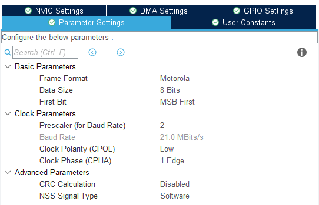
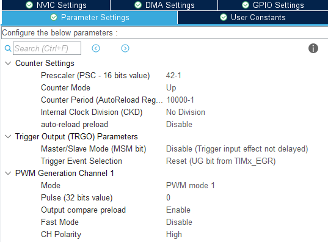

# st7735s库使用教程

## 1 日志

 * @外设相关：<font color=Red>st7735s</font >

   @版本：<font color=Red>1.0</font >

   @维护：<font color=Red>Tony_Wang</font >

   @代码规范：<font color=Red>暂无</font>
   
    
   
  
   | 版本                               |                             更新时间                             |功能|
   | :--------------------------------- | :----------------------------------------------------------: | :----------------------------------------------------------: |
   | <font color=DeepSkyBlue>1.0</font> | <font color=DeepSkyBlue>2024-3-5</font> |<font color=DeepSkyBlue>移植github开源工程，实现基本功能</font>|
   |                                    |                                         |                                                              |
   |                                    |                                         |                                                              |
   |                                    |                                          |                                                              |
   |                                    |                                          |                                                              |


 ## 2 文件介绍

> | bsp_st7735s_fonts.c      | 显示字库文件       |
> | ------------------------ | ------------------ |
> | **bsp_st7735s_fonts.h**  | **显示字库文件**   |
> | **bsp_st7735s_gfx.c**    | **绘图工具文件**   |
> | **bsp_st7735s_gfx.h**    | **绘图工具文件**   |
> | **bsp_st7735s_compat.c** | **gpio兼容性文件** |
> | **bsp_st7735s_compat.h** | **gpio兼容性文件** |
> | **bsp_st7735s_driver.c** | **驱动核心文件**   |
> | **bsp_st7735s_driver.h** | **驱动核心文件**   |
> | **bsp_st7735s.c**        | **使用封装文件**   |
> | **bsp_st7735s.h**        | **使用封装文件**   |

 ## 3 重要函数介绍

### 3.1 初始化函数

```c++
/**
 * @brief  st7735s 初始化函数
 * @details
 * @param
 * @retval
 */
void bsp_st7735s_init(rotation_t R)
{
    ST7735S_Init();
    /* 设置显示方向 */
    setOrientation(R);
    /* 清屏 */
    setColor(0, 0, 0);
    fillScreen();
}
```


```c++
/* columns: 1 = # of params, 2 = command, 3 .. = params */
static uint8_t init_cmd[] = {
    1, SWRESET,                                     /* software reset */
    1, SLPOUT,                                      /* sleep out, turn off sleep mode */
    1, DISPOFF,                                     /*  output from frame mem disabled */
    4, FRMCTR1, 0x00, 0b111111, 0b111111,           /* frame frequency normal mode (highest frame rate in normal mode) */
    4, FRMCTR2, 0b1111, 0x01, 0x01,                 /* frame frequency idle mode */
    7, FRMCTR3, 0x05, 0x3c, 0x3c, 0x05, 0x3c, 0x3c, /* frame freq partial mode: 1-3 dot inv, 4-6 col inv */
    2, INVCTR, 0x03,                                /* display inversion control: 3-bit 0=dot, 1=col */

    4, PWCTR1, 0b11111100, 0x08, 0b10, /* power control */
    2, PWCTR2, 0xc0,
    3, PWCTR3, 0x0d, 0x00,
    3, PWCTR4, 0x8d, 0x2a,
    3, PWCTR5, 0x8d, 0xee, /* partial */

    /* display brightness and gamma */
    2, GCV, 0b11011000,     /* auto gate pump freq, max power save */
    2, NVFCTR1, 0b01000000, /* automatic adjust gate pumping clock for saving power consumption */
    2, VMCTR1, 0b001111,    /* VCOM voltage setting */
    2, VMOFCTR, 0b10000,    /* ligthness of black color 0-0x1f */
    2, GAMSET, 0x08,        /* gamma 1, 2, 4, 8 */

    2, MADCTL, 0b01100000, /* row oder, col order, row colum xchange, vert refr order, rgb/bgr, hor refr order, 0, 0 */
    2, COLMOD, 0x05,       /* 3=12bit, 5=16-bit, 6=18-bit  pixel color mode */
    17, GMCTRP1, 0x02, 0x1c, 0x07, 0x12, 0x37, 0x32, 0x29, 0x2c,
    0x29, 0x25, 0x2b, 0x39, 0x00, 0x01, 0x03, 0x10,
    17, GMCTRN1, 0x03, 0x1d, 0x07, 0x06, 0x2E, 0x2C, 0x29, 0x2c,
    0x2e, 0x2e, 0x37, 0x3f, 0x00, 0x00, 0x02, 0x10,
    5, CASET, 0, 0, 0, defHEIGHT - 1,
    5, RASET, 0, 0, 0, defWIDTH - 1,
    1, INVON,  /* display inversion on/off */
    1, IDMOFF, /* idle mode off */
    1, NORON,  /* normal display mode on */
    1, DISPON, /* recover from display off, output from frame mem enabled */
};

void initCommands(void)
{
    uint8_t args;

    for (uint16_t i = 0; i < sizeof(init_cmd); i += args + 1)
    {
        args = init_cmd[i];

        SPI_Transmit(args, &init_cmd[i + 1]);
        Delay(1); // 必须延迟
    }
}
```

* 初始化发送内容如上 bsp_st7735s_driver 中，依次发送初始化数据，每个命令数据必须延迟！

### 3.2 功能函数

#### 3.2.1 基本流程

1. 设置颜色
2. 功能绘制（详见 bsp_gfx.c）
3. 缓冲区发送

#### 3.2.2 绘制线

```c++
void drawLine(uint16_t x0, uint16_t y0, uint16_t x1, uint16_t y1)
```

* 设置绘制线的起始坐标与终止坐标

#### 3.2.3 绘制圆

```c++
void drawCircle(uint16_t xc, uint16_t yc, uint16_t r)
void filledCircle(uint16_t xc, uint16_t yc, uint16_t r)
```

* 设置绘制圆的 圆心坐标 与 半径


---

<center>功能不等</center>

---

#### 3.2.4 显示字符

```c++
setbgColor((255 - r), (255 - g), (255 - b));
setFont(ter_u24b);
drawText(i, 33, "LOVE MIMI!");
```

* 设定颜色
* 设置字体
* 设置显示的位置与字符串

#### 3.2.5 缓冲区更新

```c++
flushBuffer();
```

* 调用该函数实现缓冲区内容刷新

 ## 4 自定义修改参数

bsp_st7735s_compat.c 中

```c++
uint32_t tim_period = 10000;

#define ST_BLK_TIM htim2
#define ST_BLK_TIM_CHANNEL TIM_CHANNEL_1
#define ST_HSPI hspi3

void Pin_CS_Low(void) {
    _Pin_Low(SPI3_CS);
}

void Pin_CS_High(void) {
    _Pin_High(SPI3_CS);
}

void Pin_RES_High(void) {
    _Pin_High(LCD_RES);
}

void Pin_RES_Low(void) {
    _Pin_Low(LCD_RES);
}

void Pin_DC_High(void) {
    _Pin_High(LCD_DC);
}

void Pin_DC_Low(void) {
    _Pin_Low(LCD_DC);
}
```

* 修改 IO 名称 、 背光时钟通道 、spi通道 ， pwm计数值


 ## 5 基本使用方法

### 5.1 默认使用方法

* Cube配置中，设置 spi 通道 ，IO通道 ，pwm通道等
* spi <font color='DeepSkyBlue'>速率 21M 无问题</font>（实测，上限肯定不止）
* 
* pwm <font color='DeepSkyBlue'>分频系数任意</font>，中断不用开启
* 
* 初始化使用 <font color='DeepSkyBlue'>bsp_st7735s_init(rotation_t R)</font> 设定需要的显示方向
* 调用绘制功能函数 ， 完成绘制


 ## 6 其他注意


 
