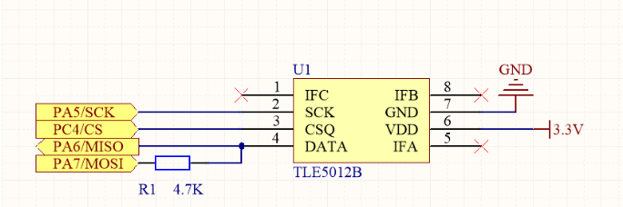

# tle5012b库使用教程

## 1 日志

 * @外设相关：<font color=Red>tle5012b</font >

   @版本：<font color=Red>1.0</font >

   @维护：<font color=Red>Tony_Wang</font >

   @代码规范：<font color=Red>暂无</font>
   
    
   
  
   | 版本                               |                             更新时间                             |功能|
   | :--------------------------------- | :----------------------------------------------------------: | :----------------------------------------------------------: |
   | <font color=DeepSkyBlue>1.0</font> | <font color=DeepSkyBlue>2023-6-24</font> |<font color=DeepSkyBlue>基本Cube配置与基本设置</font>|


 ## 2 文件介绍

> | bsp_tle5012.c     | 主文件     |
> | ----------------- | ---------- |
> | **bsp_tle5012.h** | **头文件** |

 ## 3 重要函数介绍

### 3.1 读角度函数


```c
double ReadAngle(void)
{
        return ( ReadValue(READ_ANGLE_VALUE) * 360.0 / 0x10000 );
}

uint16_t ReadValue(uint16_t u16RegValue)
{
        uint16_t u16Data;
 
        SPI_CS_ENABLE;

        HAL_SPI_Transmit( &TLE5012_SPI, (uint8_t *)(&u16RegValue), sizeof(u16RegValue)/sizeof(uint16_t), 0xff );  
        HAL_SPI_Receive( &TLE5012_SPI,(uint8_t *)(&u16Data), sizeof(u16Data)/sizeof(uint16_t), 0xff );
        SPI_CS_DISABLE;

        
        return((u16Data & 0x7FFF )<<1);
}
```

* 已经进行数据转换，转换为 double 的浮点类型数据，单位为°


 ## 4 自定义修改参数

* 使用的 spi 总线
* 使用的片选引脚

```c
#define TLE5012_SPI hspi2


#define GPIO_CS_Pin_Name TLE5012_CS_Pin
#define GPIO_CS_Pin_Type TLE5012_CS_GPIO_Port
```

<font color = "red">这里建库建的急，这里必须要重构一下</font>


 ## 5 基本使用方法

### 5.1 默认使用方法

* Cube配置中在<font color='DeepSkyBlue'>TLE5012B_CS</font>，输出 GPIO
* 配置 spi ， 目前测试 4.5M 速率无问题，据说可以18M以上
* 配置一帧数据为<font color="deepskyblue">16Bits,CPOL = 0 , CPHA = 1(2 Edge)</font>
* 循环调用<font color='DeepSkyBlue'>ReadAngle</font>


 ## 6 其他注意

* 这个芯片是一个半双工芯片，硬件电路比较奇怪，这里配置的是完整的spi，通过硬件的方式实现公用两根数据线，注意这时的硬件长这样
* 

 
